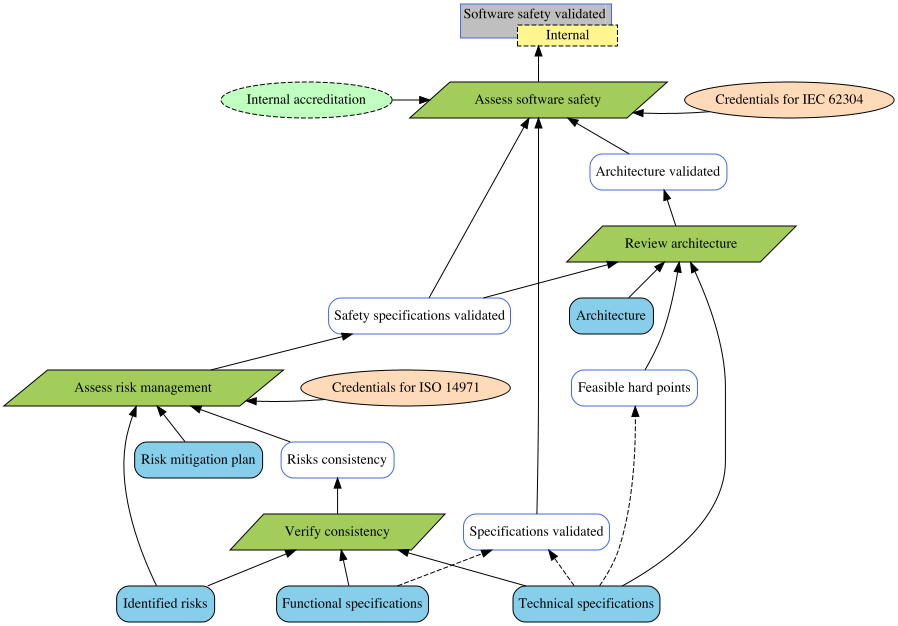

# Justification Diagram Generator

- Author : Corinne Pulgar
- Supervision : Sébastien Mosser

This prototype generates a justification diagram from a text file. 

## Dependencies

This project requires the installation of [Graphviz](https://graphviz.org/download/).

## Installation

JDGenerator is a Maven program. You can either clone the repo and run the following commands :
```
mvn install
mvn compile
```

or [download the jar file](https://github.com/ace-design/JustificationDiagram/releases/tag/v1.1).

## Execution
From the cloned repo, run 
```
mvn exec:java -Dexec.mainClass=JDCompiler -Dexec.args="[OPTIONS] [FILE]"
```

or execute the jar file with 
```
java -jar JDGenerator-jar-with-dependencies.jar [OPTIONS] [FILE]
```

### Options
| Flag  | Argument | Description                              |
|-------|----------|------------------------------------------|
| -o    | path     | Output file (no extension)               |
| -png  | -        | Generate visual graph                    |
| -gv   | -        | Generate text files before dot formating |
| -td   | -        | Generate todo list                       |

If no output file is entered, the generated files will be named from the input file name. 

## Syntax
The developped syntax strongly ressembles [PlantUML](https://plantuml.com/)'s object and class diagram syntaxes. 

### Tags
The text file should start and end by the corresponding tags.
```
@startuml

' Your code here

@enduml
```
The order of the elements, either declarations or relations, doesn't matter.

### Declarations
Write a declaration to create a node. The expected partern is as follow :
```
<TYPE> <ALIAS> = "<LABEL>"
```
The conclusion and subconclusion may have a restriction field. There can only be one conclusion per diagram.
```
<TYPE> <ALIAS> = "<LABEL>" - "<RESTRICTION>"
```

### Relations
The prototype permits two types of oriented link.

* Expanded link :
```
<ALIAS_1> --> <ALIAS_2>
```
* Collapsed link :
```
<ALIAS_1> ..> <ALIAS_2>
```

## Example
Here's an example of a text file, the graph and the todo list it generates. 

#### example.jd
```
@startuml

conclusion C = "Software safety validated" - "Internal"
strategy S = "Assess software safety"
domain D = "Internal accreditation"
rationale R = "Credentials for IEC 62304"

subconclusion C1 = "Specifications validated"

subconclusion C2 = "Architecture validated"
strategy S2 = "Review architecture"
support F = "Architecture"

subconclusion C3 = "Safety specifications validated"
strategy S3 = "Assess risk management"
rationale R3 = "Credentials for ISO 14971"
support G = "Risk mitigation plan"

subconclusion C4 = "Risks consistency"
strategy S4 = "Verify consistency"
support H = "Technical specifications"
support I = "Functional specifications"
support J = "Identified risks"

subconclusion C5 = "Feasible hard points"

S --> C
D --> S
R --> S

C1 --> S
H ..> C1
I ..> C1

C2 --> S
S2 --> C2
F --> S2
H --> S2

C3 --> S
C3 --> S2
S3 --> C3
R3 --> S3
J --> S3
G --> S3

C4 --> S3
S4 --> C4
H --> S4
I --> S4
J --> S4

C5 --> S2
H ..> C5

@enduml
```

#### example.png



> The justification diagram was adapted from _Support of Justification Elicitation: Two Industrial Reports_ by Clément Duffau, Thomas Polacsek and Mireille Blay-Fornarino, 2018.

#### example.todo

```
Requirements list

[ ]	Identified risks
[ ]	Functional specifications
[ ]	Technical specifications
[ ]	Feasible hard points
[ ]	Specifications validated
[ ]	Risk mitigation plan
[ ]	Architecture
[ ]	Risks consistency
[ ]	Safety specifications validated
[ ]	Architecture validated
-----------------------------------------------
[ ]	Software safety validated
-----------------------------------------------
```


